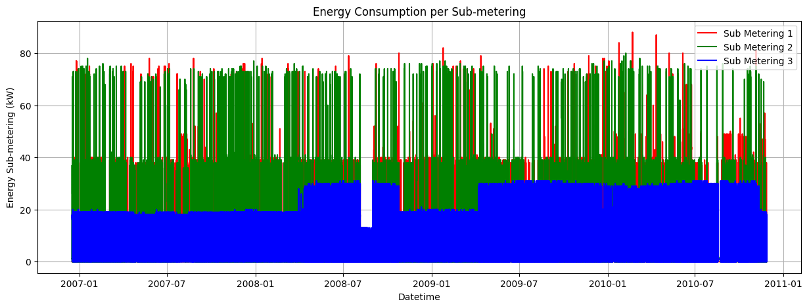
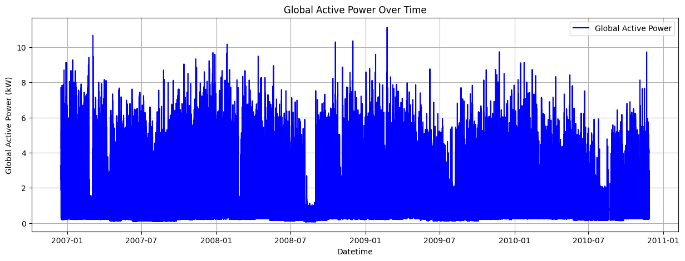
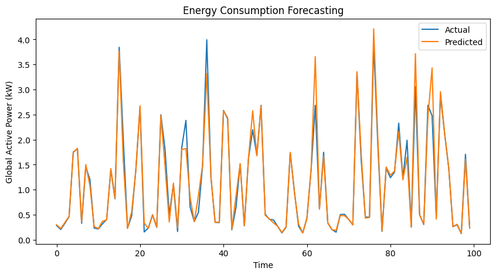

# Energy_Consumption_Forecasting_DataVerse

This project demonstrates how to preprocess energy consumption data, engineer features, and use a Long Short-Term Memory (LSTM) model to predict energy consumption. LSTM is a type of recurrent neural network (RNN) well-suited for sequence prediction tasks because it can retain long-term dependencies in data. This capability makes it ideal for time-series forecasting problems like energy consumption.

## Why LSTM?

LSTMs use a specialized gating mechanism to learn the importance of previous time steps while training. This architecture avoids issues like vanishing gradients that often affect standard RNNs. By leveraging LSTMs, we can capture temporal patterns in energy usage effectively, leading to more accurate predictions.

## Evaluation Metrics

To gauge the performance of the model, we employ metrics like:

**Mean Absolute Percentage Error (MAPE**): Measures the accuracy of predictions as a percentage, providing a normalized error metric. This helps in understanding forecast accuracy regardless of the scale.

Below, you'll find step-by-step instructions and explanations for each part of the process, complete with code snippets.

## Step 1: Data Conversion and Cleaning

Convert the raw text file into a structured CSV and clean the data by handling missing values.

<pre>
<strong style="background-color:#2d2d2d; color:#ffffff; padding: 8px; border-radius: 6px;">📄 main.py</strong>
<code>
import pandas as pd

raw_file_path = "household_power_consumption.txt"
output_csv_path = "household_power_consumption.csv"

# Read raw text file
data = pd.read_csv(raw_file_path, sep=';', low_memory=False)

# Replace '?' with NaN and drop missing rows
data.replace('?', np.nan, inplace=True)
data.dropna(inplace=True)

# Convert to appropriate data types
data = data.astype({
    "Global_active_power": float,
    "Global_reactive_power": float,
    "Voltage": float,
    "Global_intensity": float,
    "Sub_metering_1": float,
    "Sub_metering_2": float,
    "Sub_metering_3": float
})

# Save to CSV
data.to_csv(output_csv_path, index=False)
print(f"Data successfully saved to {output_csv_path}")
</code>
</pre>

## Step 2: Parsing and Feature Engineering

Load the CSV, create datetime features, and prepare the dataset for visualization and modeling.

<pre>
<strong style="background-color:#2d2d2d; color:#ffffff; padding: 8px; border-radius: 6px;">📄 main.py</strong>
<code>
# Reload CSV
import pandas as pd

data = pd.read_csv(output_csv_path, parse_dates=[["Date", "Time"]], infer_datetime_format=True)
data.rename(columns={"Date_Time": "datetime"}, inplace=True)

# Feature Engineering
data['hour'] = data['datetime'].dt.hour
data['day'] = data['datetime'].dt.day
data['month'] = data['datetime'].dt.month
data['year'] = data['datetime'].dt.year
</code>
</pre>

## Step 3: Data Visualization

Create time-series plots for energy consumption data.

<pre>
<strong style="background-color:#2d2d2d; color:#ffffff; padding: 8px; border-radius: 6px;">📄 main.py</strong>
<code>
import matplotlib.pyplot as plt

# Global Active Power Plot
plt.figure(figsize=(15, 5))
plt.plot(data['datetime'], data['Global_active_power'], label='Global Active Power', color='blue')
plt.title('Global Active Power Over Time')
plt.xlabel('Datetime')
plt.ylabel('Global Active Power (kW)')
plt.legend()
plt.grid()
plt.show()

# Sub-metering Data Plot
plt.figure(figsize=(15, 5))
plt.plot(data['datetime'], data['Sub_metering_1'], label='Sub Metering 1', color='red')
plt.plot(data['datetime'], data['Sub_metering_2'], label='Sub Metering 2', color='green')
plt.plot(data['datetime'], data['Sub_metering_3'], label='Sub Metering 3', color='blue')
plt.title('Energy Consumption per Sub-metering')
plt.xlabel('Datetime')
plt.ylabel('Energy Sub-metering (kW)')
plt.legend()
plt.grid()
plt.show()
</pre>

## Step 4: Prepare Data for LSTM

Scale the data and create sliding window sequences for time-series prediction.Z

<pre>
<strong style="background-color:#2d2d2d; color:#ffffff; padding: 8px; border-radius: 6px;">📄 main.py</strong>
<code>
from sklearn.preprocessing import MinMaxScaler
import numpy as np

# Select features and target
features = ['hour', 'day', 'month', 'Global_active_power', 'Global_reactive_power', 'Voltage']
X = data[features]
y = data['Global_active_power']

# Scale data
scaler = MinMaxScaler()
X_scaled = scaler.fit_transform(X)
y_scaled = scaler.fit_transform(y.values.reshape(-1, 1))

# Create sequences
def create_sequences(data, target, seq_length):
    sequences = []
    targets = []
    for i in range(len(data) - seq_length):
        seq = data[i:i + seq_length]
        label = target[i + seq_length]
        sequences.append(seq)
        targets.append(label)
    return np.array(sequences), np.array(targets)

seq_length = 24
X_seq, y_seq = create_sequences(X_scaled, y_scaled, seq_length)
</pre>

## Step 5: Build and Train the LSTM Model

Define the LSTM model architecture and train it with the prepared sequences

<pre>
<strong style="background-color:#2d2d2d; color:#ffffff; padding: 8px; border-radius: 6px;">📄 main.py</strong>
<code>
import torch
import torch.nn as nn
from sklearn.model_selection import train_test_split

# Split data
X_train, X_test, y_train, y_test = train_test_split(X_seq, y_seq, test_size=0.2, random_state=42)

# Convert to PyTorch tensors
X_train_tensor = torch.tensor(X_train).float()
X_test_tensor = torch.tensor(X_test).float()
y_train_tensor = torch.tensor(y_train).float()
y_test_tensor = torch.tensor(y_test).float()

# Define LSTM model
class PowerConsumptionLSTM(nn.Module):
    def __init__(self, input_size, hidden_size, output_size):
        super(PowerConsumptionLSTM, self).__init__()
        self.hidden_size = hidden_size
        self.lstm = nn.LSTM(input_size, hidden_size, batch_first=True)
        self.fc = nn.Linear(hidden_size, output_size)

    def forward(self, x):
        _, (h_n, _) = self.lstm(x)
        out = self.fc(h_n[-1])
        return out

# Initialize model
input_size = X_train.shape[2]
hidden_size = 50
output_size = 1
model = PowerConsumptionLSTM(input_size, hidden_size, output_size)

# Define loss function and optimizer
criterion = nn.MSELoss()
optimizer = torch.optim.Adam(model.parameters(), lr=0.001)

# Training loop
n_epochs = 50
for epoch in range(n_epochs):
    model.train()
    optimizer.zero_grad()
    output = model(X_train_tensor)
    loss = criterion(output, y_train_tensor)
    loss.backward()
    optimizer.step()

    if (epoch + 1) % 10 == 0:
        print(f"Epoch {epoch + 1}/{n_epochs}, Loss: {loss.item()}")
</code>
</pre>

## Step 6: Evaluate the Model

Evaluate the model's performance on the test set and visualize the results.

<pre>
<strong style="background-color:#2d2d2d; color:#ffffff; padding: 8px; border-radius: 6px;">📄 main.py</strong>
<code>
import torch
from torch.utils.data import DataLoader, TensorDataset
import numpy as np

# Move model and data to GPU (if available)
device = torch.device("cuda" if torch.cuda.is_available() else "cpu")
model = model.to(device)
X_test_tensor = X_test_tensor.to(device)

# Create a DataLoader for batching
test_dataset = TensorDataset(X_test_tensor)
test_loader = DataLoader(test_dataset, batch_size=32)

# Evaluate model in batches
predictions = []
with torch.no_grad():
    for batch in test_loader:
        batch = batch[0]  # Extract batch
        batch_preds = model(batch).cpu().numpy()  # Move predictions back to CPU
        predictions.append(batch_preds)

# Combine all predictions
predictions = np.concatenate(predictions, axis=0)

# Inverse transform predictions
predictions = scaler.inverse_transform(predictions)

</code>
</pre>

## Step 7 : Visualization

This graph should the predicted vs actual difference of the energy consumption.

<pre>
<strong style="background-color:#2d2d2d; color:#ffffff; padding: 8px; border-radius: 6px;">📄 main.py</strong>
<code>
predicted_data = pd.DataFrame({"Actual": y_test_actual.flatten(), "Predicted": predictions.flatten()})
predicted_data.to_csv("energy_forecast.csv", index=False)
print("Predictions saved to energy_forecast.csv")
</code>
</pre>

## Step 7: Save Predictions

Save the actual and predicted values to a CSV file for further analysis.

<pre>
<strong style="background-color:#2d2d2d; color:#ffffff; padding: 8px; border-radius: 6px;">📄 main.py</strong>
<code>
# Define the device
device = torch.device("cuda" if torch.cuda.is_available() else "cpu")
model.to(device)  # Move the model to the appropriate device

# Evaluate model
model.eval()
batch_size = 100
num_batches = len(X_test_tensor) // batch_size

actual_values = []
predicted_values = []

with torch.no_grad():
    for i in range(num_batches):
        # Move input batch to the same device as the model
        X_batch = X_test_tensor[i * batch_size:(i + 1) * batch_size].to(device)
        y_batch = y_test_tensor[i * batch_size:(i + 1) * batch_size].to(device)

        # Predict and scale back
        predictions_batch = model(X_batch).cpu().numpy()  # Move output to CPU for NumPy conversion
        predictions_batch = scaler.inverse_transform(predictions_batch)
        actual_batch = scaler.inverse_transform(y_batch.cpu().numpy())  # Move target to CPU for scaling back

        actual_values.extend(actual_batch)
        predicted_values.extend(predictions_batch)

# Convert lists back to numpy arrays
actual_values = np.array(actual_values)
predicted_values = np.array(predicted_values)

# Plot results (Subset to the first 100 samples for visualization)
plt.figure(figsize=(10, 5))
plt.plot(actual_values[:100], label="Actual")
plt.plot(predicted_values[:100], label="Predicted")
plt.legend()
plt.title("Energy Consumption Forecasting")
plt.xlabel("Time")
plt.ylabel("Global Active Power (kW)")
plt.show()
</code>
</pre>

## Step 8 : RMSE and Error Analysis

Calculate the RMSE score and analyze prediction errors.

<pre>
<strong style="background-color:#2d2d2d; color:#ffffff; padding: 8px; border-radius: 6px;">📄 main.py</strong>
<code>
from sklearn.metrics import mean_squared_error
import numpy as np

# Calculate RMSE
rmse = np.sqrt(mean_squared_error(actual_values, predicted_values))
print(f"RMSE: {rmse}")

</code>
</pre>

